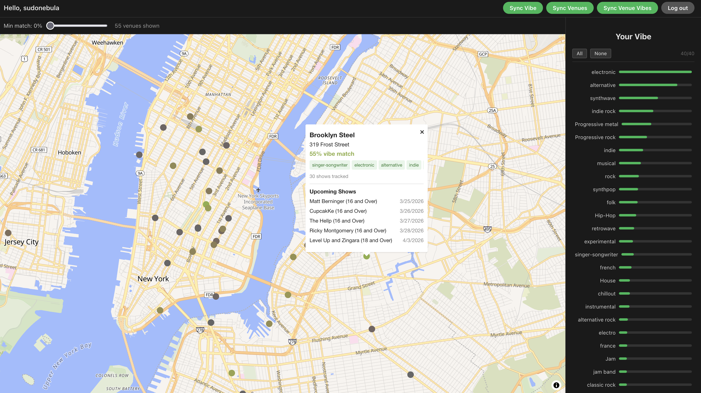

# Vibe Seeker

A venue-centric discovery app for New York City. Connect your Spotify account, and Vibe Seeker builds a taste profile from 
your listening history, then scores nearby bars, clubs, and small venues based on the genres and artists they typically 
book.

The theory is that there are probably lots of smaller venues near you playing bands you've never heard of that you'd 
probably like.  Relying on tools that suggests specific acts isn't helpful because you've probably never heard of 
random-local-act-123 

Small venues tend to book bands in the same genre.  If we can tell you that a particular spot typically plays genres of 
music that you like to listen to maybe we can give you the confidence to go check it out regardless of whose playing.  Or 
at least enough confidence to spend a few minutes listening to someone's SoundCloud instead of every SoundCloud for every 
artist in NYC

## How It Works

1. Log in with Spotify
2. The app reads your top artists and genres
3. NYC venue data is fetched from Ticketmaster
4. Each venue gets a vibe profile built from its booking history, and future
5. Venues vibes are scored against your vibe using cosine similarity
6. An interactive map shows scored venues with match reasons and upcoming shows
7. Filter venues by % match to identify venues that play shows most similar to your vibe
8. Click styles to add & remove them from your overall vibe and watch venues recalculate their match in real time



## Stack

| Layer         | Tech                                                                   |
|---------------|------------------------------------------------------------------------|
| Backend       | Go (`net/http`, stdlib-first), PostgreSQL                              |
| Frontend      | React 19, Vite, TypeScript, MapLibre GL (via react-map-gl)             |
| Auth          | Spotify OAuth2 → self-issued HMAC-SHA256 JWTs (HttpOnly cookies)       |
| Observability | OpenTelemetry (HTTP + pgx tracing, context-aware structured logging)   |
| CI/CD         | GitHub Actions                                                         |

## Prerequisites

- [Go 1.26+](https://go.dev/dl/)
- [Node.js 22+](https://nodejs.org/)
- [Podman](https://podman.io/) (or docker)
- [just](https://github.com/casey/just) (or look at the justfiles for the raw commands)
- A Spotify account
- Developer accounts with registered apps from
  - Spotify
  - Ticketmaster
  - Last.fm

## Running Locally

Create developer accounts and/or "apps" in Spotify, Last.fm, and Ticketmaster.  Gathering their keys, secrets, and setting 
callback URL in the Spotify app

> **Note:** Use `127.0.0.1` instead of `localhost` for the Spotify app's callback — the Spotify API forbids `localhost` 
> in redirect URIs.

```bash
cp backend/.env.example backend/.env  
# then fill in gathered credentials and JWT_SECRET (random string)

just dev
# go to http://127.0.0.1:5173 in a browser
```

See [backend/README.md](backend/README.md) and [frontend/README.md](frontend/README.md) for more details.

## Project Structure

```
vibe-seeker/
├── backend/
│   ├── internal/
│   │   ├── auth/            # JWT creation/validation, OAuth state
│   │   ├── configuration/   # Env var loading, app-wide constants
│   │   ├── handlers/        # HTTP handlers (auth, vibe, venues)
│   │   ├── lastfm/          # Last.fm API client, tag fetching + filtering
│   │   ├── middleware/       # Auth middleware, CORS
│   │   ├── migrations/      # Embedded SQL migrations (auto-applied on startup)
│   │   ├── observability/   # OpenTelemetry init, context-aware logging
│   │   ├── ratelimit/       # Reusable context-aware rate limiter
│   │   ├── spotify/         # Spotify API client (OAuth, top artists, token refresh)
│   │   ├── store/           # PostgreSQL persistence (users, venues, tags, vibes)
│   │   ├── ticketmaster/    # Ticketmaster Discovery API client
│   │   ├── vibes/           # Shared vibe computation (user + venue)
│   │   └── webserver/       # Server wiring, route registration
│   ├── cmd/migrate/         # Standalone migration CLI
│   └── main.go
├── frontend/
│   ├── src/
│   │   ├── components/      # TopBar, VenueMap, VibeSidebar
│   │   ├── pages/           # Home, Login, Callback
│   │   ├── utils/           # Cosine similarity, match color gradient
│   │   └── types.ts         # Shared TypeScript interfaces
│   └── vite.config.ts
├── docs/                    # Architecture docs and learnings (planned)
├── compose.yml              # Local dev (postgres, backend, frontend)
└── justfile                 # Task runner recipes
```

## Useful Commands

```bash
just dev              # Start all services for local development
just ci               # Run full CI pipeline (lint, test, build, container build)
just test             # Run unit tests (backend + frontend)
just check            # Run static analysis (backend + frontend)
just fmt              # Format code (backend + frontend)
just up               # Start all services in production containers
just down             # Stop all services
just db               # start just the postgres database
```

## License

Licensed under the [Apache License 2.0](LICENSE).
