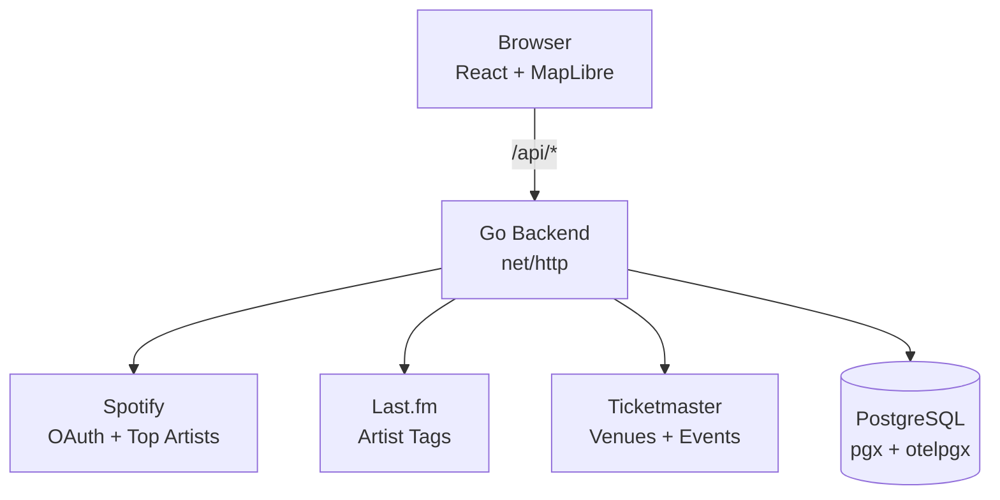
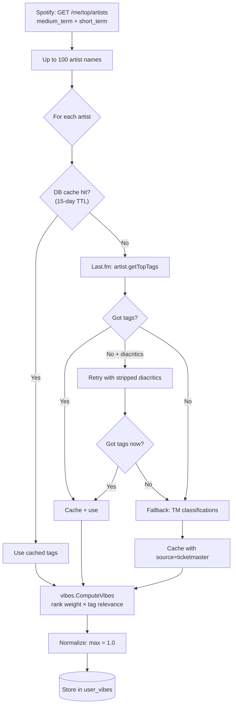
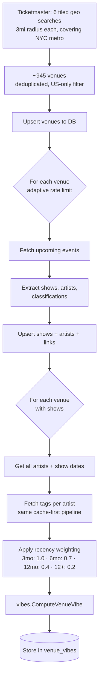
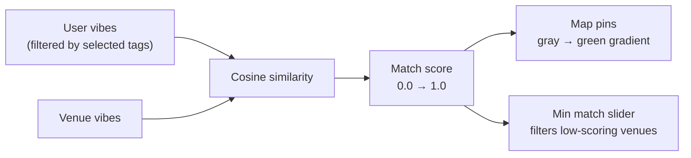

# System Architecture

## High-Level Overview

## Backend Package Structure

The backend follows Go's `internal/` convention. Each package has a single responsibility:

| Package         | Responsibility                                                              |
|-----------------|-----------------------------------------------------------------------------|
| `auth`          | JWT creation/validation, OAuth state generation                             |
| `configuration` | Environment variables, app-wide constants (TTLs, rate limits)               |
| `handlers`      | HTTP handlers — auth flow, vibe sync, venue sync                            |
| `lastfm`        | Last.fm API client, tag fetching with diacritics retry and filtering        |
| `middleware`    | Auth middleware (JWT from cookies), CORS                                    |
| `migrations`    | Embedded SQL migrations, auto-applied on startup                            |
| `observability` | OpenTelemetry initialization, context-aware structured logging              |
| `ratelimit`     | Reusable context-aware ticker-based rate limiter                            |
| `spotify`       | Spotify API client — OAuth, top artists, token refresh                      |
| `store`         | PostgreSQL persistence — users, venues, shows, artist tags, vibes           |
| `ticketmaster`  | Ticketmaster Discovery API client — venues, events, pagination              |
| `vibes`         | Shared vibe computation (user vibes and venue vibes use the same algorithm) |
| `webserver`     | Server construction, route registration, middleware wiring                  |

## Data Flow

### User Vibe Sync

### Venue Sync + Vibe Computation

### Matching (Frontend)

## Authentication

Spotify OAuth2 Authorization Code flow with self-issued JWTs:

1. User clicks "Login with Spotify" → redirect to Spotify authorization
2. Spotify redirects back with auth code → backend exchanges for access + refresh tokens
3. Backend creates HMAC-SHA256 JWT with user's Spotify ID and display name
4. JWT stored as HttpOnly cookie (not localStorage, not Bearer header)
5. All API calls include the cookie automatically — frontend never touches the token
6. Token refresh happens server-side before Spotify API calls when the access token is near expiry

**Why HttpOnly cookies?** Immune to XSS token theft. The frontend can't read the token, which means a compromised dependency 
can't exfiltrate it.

## Observability

- **HTTP tracing**: `otelhttp` middleware wraps all routes — automatic span generation with method, path, status, duration
- **Database tracing**: `otelpgx` traces every SQL query with span context propagation
- **Context-aware logging**: `observability.Logger(ctx)` extracts trace_id and span_id from the request context, attaching
  them to every slog call. Logs from a single request can be correlated across handler → store → external API calls.
- **Exporters**: OTLP gRPC to Grafana Cloud (or any OTel-compatible backend)

## Database

PostgreSQL with embedded SQL migrations (auto-applied on startup). Key tables:

| Table                  | Purpose                                                         |
|------------------------|-----------------------------------------------------------------|
| `users`                | Spotify users with encrypted tokens                             |
| `user_vibes`           | User's computed vibe profile (tag → weight)                     |
| `venues`               | Ticketmaster venues with coordinates and metadata               |
| `shows`                | Upcoming events at venues                                       |
| `artists`              | Performers (slugified name as ID)                               |
| `show_artists`         | Many-to-many link with billing order                            |
| `show_classifications` | Ticketmaster's genre taxonomy per show                          |
| `artist_tags`          | Read-through cache for Last.fm/TM tag data (with source column) |
| `venue_vibes`          | Venue's computed vibe profile (tag → weight)                    |
